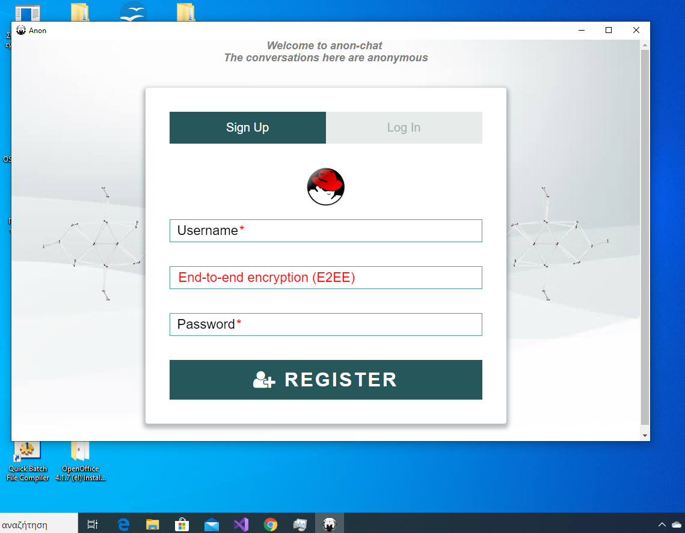
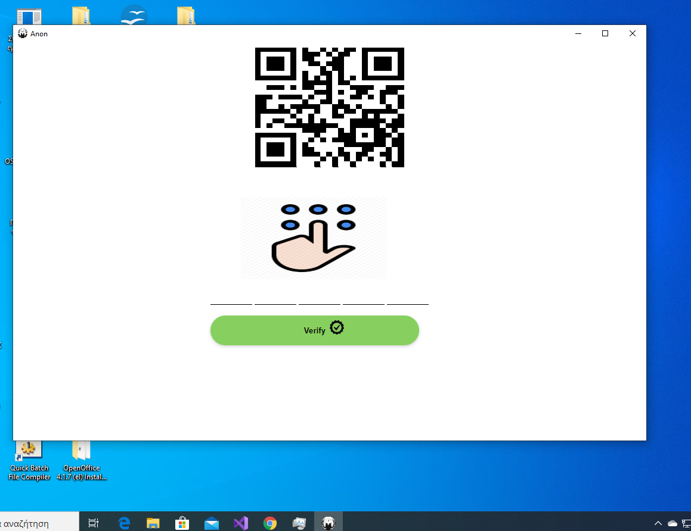
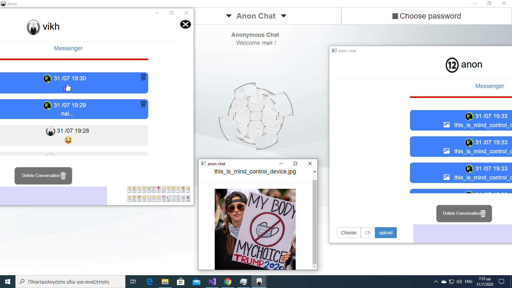
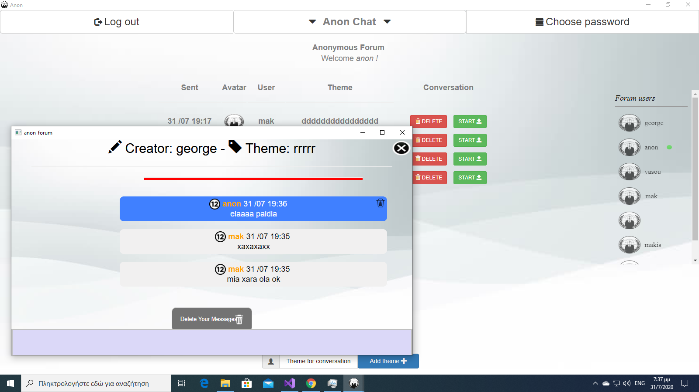

# anon-chat-v3-windows
anon-chat-v3 is a program that allows anonymous conversations.  
This is the application for windows os   
This programma have E2EE and AES 256 CBC for conversations   

<a href="http://anon.www1.gr/Anon.7z"> Download </a>   

1) Download zip file  
2) Extract files in same folder   
3) Run the Anon file    

  

  

       
        
       
       > 
       
