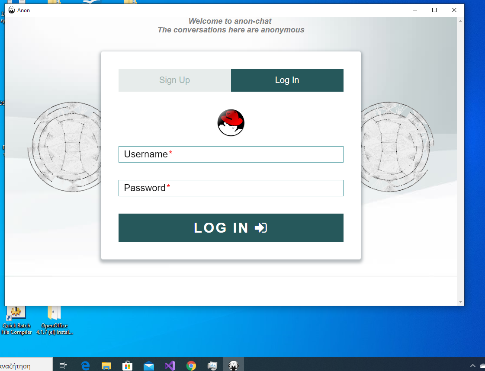

# anon-chat-v3-windows
anon-chat-v3 is a program that allows anonymous conversations.  
This is the application for windows os   
This programma have E2EE and AES 256 CBC for conversations   

         
[img/2](img/2.png)       
[img/3](img/3.png)       
[img/4](img/4.png)       
[img/5](img/5.png)      
